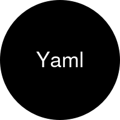

<p align="center">
  <a href="" rel="noopener">
  </a>
</p>

<h1 align="center">Drop-in replacement for Symfony's Yaml component with comments support.</h1>

<div align="center">

[](https://github.com/alexskrypnyk/yaml/issues)
[](https://github.com/alexskrypnyk/yaml/pulls)
[](https://github.com/alexskrypnyk/yaml/actions/workflows/test-php.yml)
[](https://codecov.io/gh/alexskrypnyk/yaml)


</div>

---

## Why

Symfony's Yaml component is a powerful tool for parsing and dumping YAML files,
but it does not preserve source comments or formatting.

This library parses YAML into an AST tree, which allows for advanced manipulation
of YAML files while preserving comments and formatting. It uses Symfony's Yaml
component under the hood to parse values.

## Features

- **AST-based manipulation**: Advanced YAML editing with path-based navigation
- **Comment preservation**: Maintains YAML comments when parsing and dumping
- **Format preservation**: Keeps original indentation and structure where possible
- **Tree traversal**: Visit all nodes in the YAML tree with custom callback functions
- **Node modification**: Modify or remove nodes during tree traversal
- **Ungreedy quoting**: Automatically removes unnecessary quotes for cleaner output
- **Instance-based API**: Clean object-oriented interface for YAML manipulation

## Installation

    composer require alexskrypnyk/yaml

## Usage

Create a YAML instance to manipulate YAML files with comment preservation:

```php
use AlexSkrypnyk\Yaml\Yaml;
use AlexSkrypnyk\Yaml\Ast\Node;
use AlexSkrypnyk\Yaml\Ast\NodeType;

// Create YAML manipulator instance
$yaml = new Yaml();

// Load YAML file
$yaml->load('config.yml');

// Get values using dot-path notation
$value = $yaml->getValue(['commands', 'build', 'cmd']);

// Set/update values
$yaml->setValue(['commands', 'build', 'cmd'], 'docker build .');

// Add new keys with optional comments
$yaml->addKey(['commands'], 'deploy', [
    'usage' => 'Deploy the application',
    'cmd' => 'make deploy'
], '# Deployment command');

// Check if keys exist
if ($yaml->has(['commands', 'test'])) {
    echo 'Test command exists';
}

// Delete keys
$yaml->deleteKey(['commands', 'old-command']);

// Work with comments
$yaml->setComment(['commands', 'build'], '# Build-related tasks');
$comment = $yaml->getComment(['commands', 'build']);

// Save back to file (preserves comments and formatting)
$yaml->save('config.yml');

// Or get as string
$yamlString = $yaml->dump();

// Visit all nodes in the tree with a callback
$yaml->visit(function (Node $node, array $parent_path) {
    // Modify node values
    if ($node->type === NodeType::KeyValue && is_string($node->value)) {
        $node->value = 'prefix-' . $node->value;
    }

    // Remove nodes by returning NULL
    if ($node->key === 'unwanted-key') {
        return NULL; // Removes this node from the tree
    }

    return $node; // Keep the node
});
```

#### Path-based Navigation

All manipulation methods use array-based paths to navigate nested YAML structures:

```yaml
# For this YAML structure:
project: my-app
commands:
  build:
    usage: Build the project
    cmd: make build
  test:
    usage: Run tests
    cmd: make test
```

```php
// Access values using paths
$yaml->getValue(['project']);                    // Returns: "my-app"
$yaml->getValue(['commands', 'build', 'cmd']);   // Returns: "make build"

// Update nested values
$yaml->setValue(['commands', 'build', 'cmd'], 'docker build .');

// Add new nested structures
$yaml->addKey(['commands'], 'lint', [
    'usage' => 'Lint the code',
    'cmd' => 'make lint'
]);
```

#### Tree Traversal with Visit Method

The `visit()` method allows you to traverse all nodes in the YAML tree and apply custom logic to each node. The visitor callback receives each node and its parent path:

```php
$yaml->visit(function (Node $node, array $parent_path) {
    // The callback receives:
    // - $node: Current node being visited
    // - $parent_path: Array of parent keys leading to this node

    echo "Visiting: " . ($node->key ?? 'sequence item') . "\n";
    echo "Parent path: " . implode(' -> ', $parent_path) . "\n";

    // Return the node to keep it, or NULL to remove it
    return $node;
});
```

**Common use cases:**

```php
// Modify all string values
$yaml->visit(function (Node $node, array $parent_path) {
    if ($node->type === NodeType::KeyValue && is_string($node->value)) {
        $node->value = strtoupper($node->value);
    }
    return $node;
});

// Remove nodes conditionally
$yaml->visit(function (Node $node, array $parent_path) {
    // Remove all 'debug' keys
    if ($node->key === 'debug') {
        return NULL; // Removes the node
    }

    // Remove nodes in development environment
    if (in_array('development', $parent_path) && $node->key === 'secret') {
        return NULL;
    }

    return $node; // Keep the node
});

// Collect information about the tree structure
$statistics = ['keys' => 0, 'values' => 0, 'comments' => 0];
$yaml->visit(function (Node $node, array $parent_path) use (&$statistics) {
    if ($node->key !== NULL) $statistics['keys']++;
    if ($node->value !== NULL) $statistics['values']++;
    if ($node->attachedComment !== NULL) $statistics['comments']++;
    return $node;
});
```

## Flags

### `DUMP_COLLAPSE_LITERAL_BLOCK_EMPTY_LINES`

Collapses consecutive empty lines anywhere within YAML literal blocks (after pipe characters `|`). This includes empty lines at the start and middle of literal block content, but preserves empty lines outside of literal blocks:

```php
$yaml = new Yaml();
$yaml->parseFile('config.yml');
$output = $yaml->dump(Yaml::DUMP_COLLAPSE_LITERAL_BLOCK_EMPTY_LINES);
```

## Maintenance

    composer install
    composer lint
    composer test

---
_This repository was created using the [Scaffold](https://getscaffold.dev/) project template_
